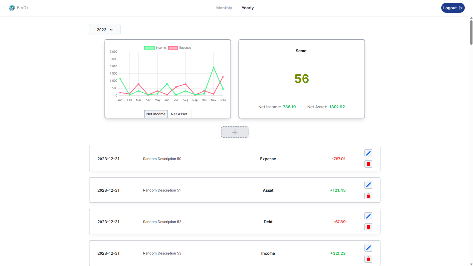

<div align='center'><h1>Financial Health Indicator App</h1></div>
<div align='center'> 

</div>

<div align='center'><h3><a href="https://rush1dan-financial-health.netlify.app" target="_blank">View Live Demo</a></h3></div>

## About
This is a full stack financial health indicator app.

## Features
- User authentication
- Add transaction record
- Filter by month or year
- Get a financial score based on transactions

## Dev
First, install necessary packages:
```bash
npm install
```

Then, run the development server:

```bash
npm run dev
# or
yarn dev
# or
pnpm dev
# or
bun dev
```

Open [http://localhost:3000](http://localhost:3000) with your browser to use the started application.

## Built With
<div>
<h4>Front End:</h4>

<div>


</div>

<h4>Back End:</h4>

<div>


</div>

</div>